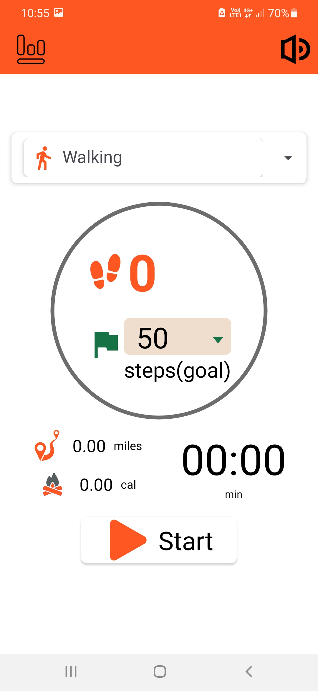
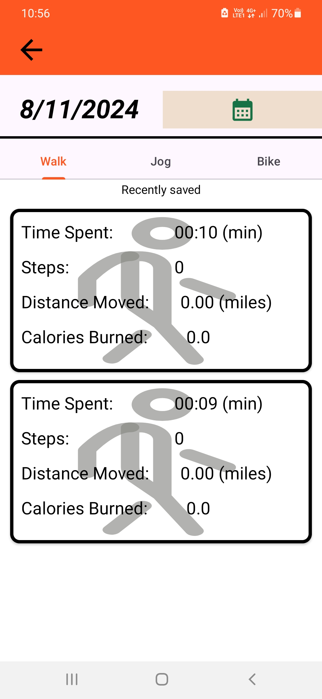

# Pedometer (Step Counter) App

## Screenshots:

  
  

## Download the App:

## Description:
The Pedometer (Step Counter) app tracks your steps and helps you stay healthy. It uses the phone's sensors to count your steps and displays them on a user-friendly interface.

## Features:
- Tracks daily steps
- View your step history
- Set daily goals

## License:
This project is licensed under the MIT License - see the [LICENSE](LICENSE) file for details.
